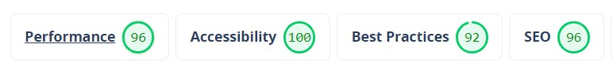

<h1>Julius Ceasar</h1>
Julius Ceasar is a website that allows users to go into depth of the life Julius Ceasar. It will give a detailed timeline of Ceasar political career until his death. it also gives a showcase of legendary battles that influenced his life. View the live site <a href="https://frangidha.github.io/History-project/">here</a>

<h3>Features</h3>
<ul>
<li>Site wide</li>
<li>Navigation Menu</li>
<li>Contains links to the Home, Political Career and Legendary battles pages and will be responsive on all devices(320px min-width).
This will allow users to easily navigate between the pages within the site on any size device.</li>

</ul>

<h3>Footer</h3>

This will contain icons as links to social media websites that will open in new tabs. Icons will be accessible to the visually impaired who may be using a screen reader, by the use of aria labels. The second part of the footer will contain bibliography of the website where all the text and info comes from. 
This will allow the user to go to various social media where they can share the website. 
The Bibliography will allow user to go the sources of the website and go even more into depth into the life of ceasar.

<h3>Landing Page</h3>

Landing page image
This will be a collection of the hero images from the politcal career and legendary battle page. 
This will help to immediately show the user what the website is about.

<h3>Website information on 'Home'</h3>

Information about 'Julius Ceasar' and the websites purpose including an image of "julius Ceasar" of one of his honorary statues.
This information lets the user know what the site is about.

 

<h3>Website information on 'Political Career'</h3>

will provide the user with a timeline of Ceasar political career. together with Basic information of what the different politcal positions are.

<h3>Website information on 'Legendary Battles'</h3>

Legendary Battles Summary
it explains why he was such a great and inspirational leader and how he gained all his successes.

details containing one photo of the famous battle, a paragraph about the battle.
The sections will give the user an overview of the legendary battles that "Julius ceasar"  was part of during his life.

<h3>Existing Features</h3>
<ul>
<li>Responsive design</li>
<li>navigation menu</li>
<li>Hidden interactive sections on Legendary Battle page</li>
<li>3 legendary battles and information</li>
<li>Timeline of Political career</li>
</ul>

<h3>Features Left to Implement</h3>

More content about ceasar and adding dropdown navigation bars(adding videos).
adding some animation for the pictures. 
 

<h3>Design</h3>
<h4>website design</h4>

Home page

Political Career

Battle

<h4>phone design</h4>

Home page

Political Career

Battle

<h3>Technologies</h3>
<ul>
<li>HTML</li>

The structure of the Website was developed using HTML as the main language.

<li>CSS</li>

The Website was styled using custom CSS in an external file.

<li>Visual Studio Code</li>

The website was developed using Visual Studio Code IDE

<li>GitHub </li>

Source code is hosted on GitHub and delpoyed using Git Pages.

<li>Git </li>

Used to commit and push code during the development opf the Website

<li>Font Awesome</li>

Icons obtained from https://fontawesome.com/ were used as the Social media links in the footer section.

<li>balsamiq</li>

wireframes were created using balsamiq from https://balsamiq.com/wireframes/desktop/#

</ul>
<h3>Testing</h3>
<h4>Responsiveness</h4>

All pages were tested to ensure responsiveness on screen sizes from 500px and upwards as defined in WCAG 2.1 Reflow criteria for responsive design on Chrome, Edge, Firefox and Opera browsers.

Steps to test:

<ul>
<li>Open browser and navigate to Julius Ceasar</li>
<li>Open the developer tools (right click and inspect)</li>
<li>Set to responsive and decrease width to 320px</li>
<li>Set the zoom to 50%</li>
<li>Click and drag the responsive window to maximum width</li>
</ul>

Expected:

Website is responsive on all screen sizes and no images are pixelated or stretched. No horizontal scroll is present. No elements overlap.

Actual:

Website behaved as expected.

Website was also opened on the following devices and no responsive issues were observed

<h4>Testing was focused to ensure the following criteria were met:</h4>

Color contrasts meet a minimum ratio as specified in WCAG 2.1 Contrast Guidelines
Heading levels are not missed or skipped to ensure the importance of content is relayed correctly to the end user
All content is contained within landmarks to ensure ease of use for assistive technology, allowing the user to navigate by page regions
All not textual content had alternative text or titles so descriptions are read out to screen readers
HTML page lang attribute has been set
Aria properties have been implemented correctly
WCAG 2.1 Coding best practices being followed
Manual tests were also performed to ensure the website was accessible as possible and an accessibility issue was identified.

Issue #1: background images didn't display 

Fix: changed the absolute path way to a relative pathway

<h3>lighthouse testing</h3>

Home page

Political Career page

Legendary Battle page

<h3>Functional Testing</h3>

<h4>Navigation Links</h4>

Testing was performed to ensure all navigation links on the respective pages, navigated to the correct pages as per design. This was done by clicking on the navigation links on each page.

Navigation Link	Page to Load
Home	              index.html
Politcal Career	      politcal.html
Legendary battles	  battles.html

Links on all pages navigated to the correct pages as exptected.

<h4>Footer Social Media Icons / Links</h4>

Testing was performed on the Font Awesome Social Media icons in the footer to ensure that each one opened in a new tab.

Each item opened a new tab when clicked as expected.

Footer bibliography

the footer was made with APA sourcing to the actual text/content creators.

<h4>Validator Testing</h4>
<ul>
<li>HTML</li>

No errors were returned when passing through the official W3C validator

index HTML Validator Results

Poltical HTML Validator Results

Battles HTML Validator Results

404 HTML Validator Results

image

<li>CSS</li>

No errors were found when passing through the official (Jigsaw) validator

CSS Validator Results

index CSS Validator Results

Poltical CSS Validator Results

Battle CSS Validator Results

</ul>

<h3>Unfixed Bugs</h3>
Responsiveness of the website worked on all devices and screen sizes. On very small screen the image of ceasar doesn't stay center.

<h3>Deployment</h3>
<h4>Version Control</h4>
The site was created using the Visual Studio code editor and pushed to github to the remote repository ‘history’.

The following git commands were used throughout development to push code to the remote repo:

git add <file> - This command was used to add the file(s) to the staging area before they are committed.

git commit -m “commit message” - This command was used to commit changes to the local repository queue ready for the final step.

git push - This command was used to push all committed code to the remote repository on github.

<h4>Deployment to Github Pages</h4>
The site was deployed to GitHub pages. The steps to deploy are as follows:
<ul>
<li>In the GitHub repository, navigate to the Settings tab</li>
<li>From the menu on left select 'Pages'</li>
<li>From the source section drop-down menu, select the Branch: main</li>
<li>Click 'Save'</li>
<li>A live link will be displayed in a green banner when published successfully.</li>
<li>The live link can be found here - https://frangidha.github.io/History-project/</li>
 </ul>

<h4>Clone the Repository Code Locally</h4>
Navigate to the GitHub Repository you want to clone to use locally:
<ul>
<li>Click on the code drop down button</li>
<li>Click on HTTPS</li>
<li>Copy the repository link to the clipboard</li>
<li>Open your IDE of choice (git must be installed for the next steps)</li>
<li>Type git clone copied-git-url into the IDE terminal</li>
<li>The project will now of been cloned on your local machine for use.</li>
</ul>
<h3>Credits</h3>
Timeline W3C schools
Code was inspirited from this site to create the accordian effect on the politcal career page timeline section. Styles were changed to suit styling on my Website.

Code insitute
the code insitute curriculum was used to develop the entire website.

<h3>Media</h3>

all media were taken form <a href="https://www.shutterstock.com/explore/flex-subscriptions?c3apidt=p68161268801&gclid=EAIaIQobChMI0vGyntaD_AIVjd1RCh05jgE2EAAYASAAEgLsDvD_BwE&gclsrc=aw.ds&kw=free%20pictures">free image sources</a> and <a href="https://www.wikipedia.org/">wikepidia</a>. the sources can be found in the Bibliography (see footer)

